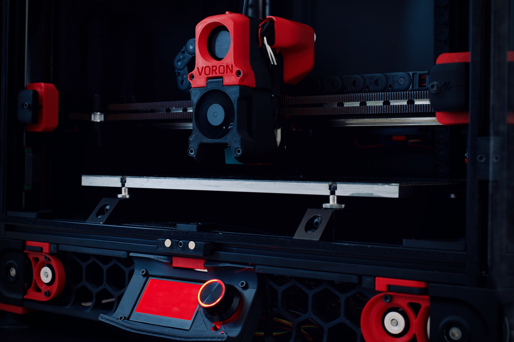

# Welcome

Welcome to the world of Voron 3D printers!

This is the Voron Documentation site. All of the information needed to go from zero to a working Voron printer can be found here.

## Official Documentation

This information is considered to be "official" and what is supported.  If this is the first visit, please start with the overview.

1. [Overview](./official/README.md)
2. [About Voron](./official/about.md)
3. [Choosing A Printer / Extruder](./official/hardware/README.md)
4. [Sourcing Information](./official/sourcing.md)
5. [The Build](./official/build/README.md)
6. [Tuning Guides](./official/tuning/README.md)
7. [Maintenance](./official/maintenance/README.md)
8. [Voron History](./official/history.md)

## Community Documentation

This documentation is community provided.  It may contain some different methods or guidance from the official documentation.

1. [How To Guides](./community/howto/README.md)
2. [Troubleshooting](./community/troubleshooting/README.md)
3. [Alternate Electronics](./community/electronics/README.md)
4. [Custom Macros](./community/macros/README.md)
5. [Video Guides](./community/video_guides.md)
6. [Other Resources](./community/resources.md)

