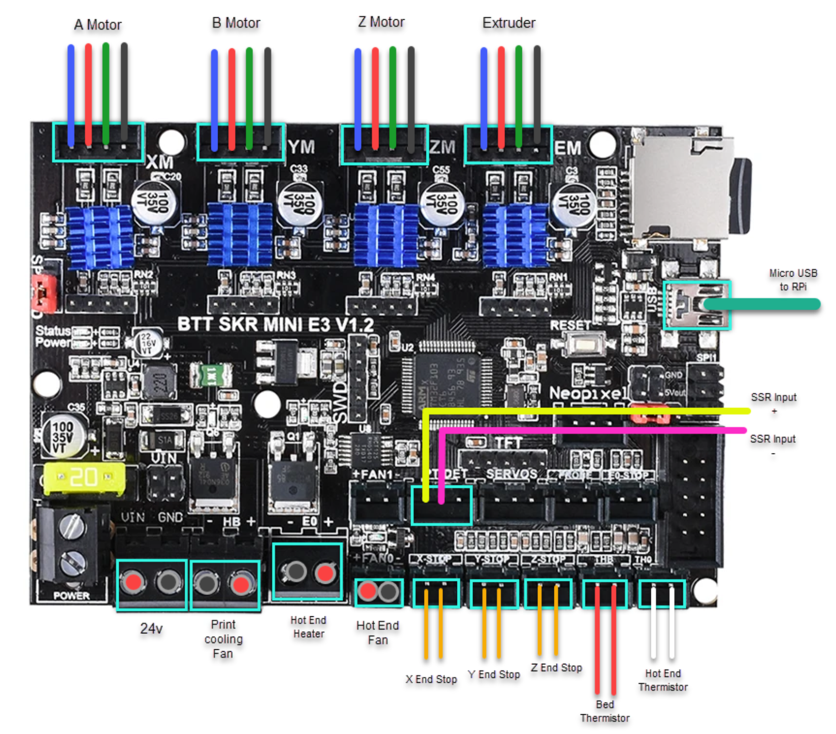
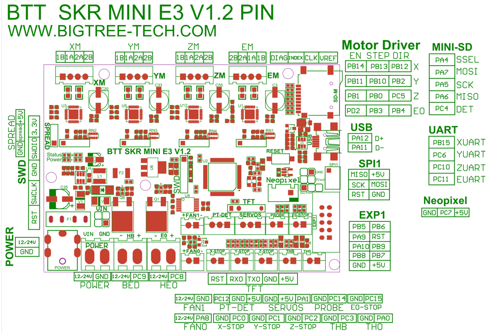

# Voron V0 - SKR mini E3 V1.2 Wiring

## MCU

* Plug in stepper motors for X, Y, Z, and E in positions Xm, Ym, Zm, and Em
* Plug Hot End thermistor to thermistor TH0
* Plug Hot End heater in to E0
* Plug Hot End Fan in to FAN0
* Plug Part Cooling Fan in to HB
* Plug Bed Thermistor in to THB
* Connect SSR pins to PT-DET connector
* Connect X end stop to X-STOP connector
* Connect Y end stop to Y-STOP connector
* Connect Z end stop to Z-STOP connector
* Wire 24V and -V from DC power supply to VIN and GND
* Connect USB Cable to your SKR mini E3, but do not connect it yet to your Raspberry Pi

## Mini E3 V1.2 Pinout

For reference, here is the pinout of the SKR mini E3 V1.2

