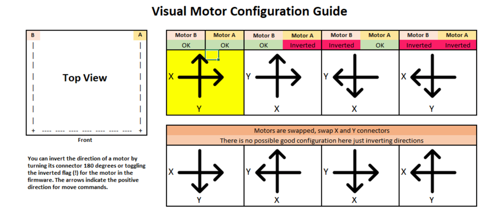

# Introduction

This setup guide containes all the the steps to go from an assembled printer into a functioning printer with a known working configuration.

Please read the guide carefully, there are many details that seem trivial but are included because of one or more people got stuck at these points. We as a community want to make sure that everyone has the best experience possible and learn from our mistakes. If you find a something confusing and would like clarification, that likely means someone else in the past or future will also find it difficult. Please reach out and we will gladly update the document.

It is designed to be a "universal" setup guide that can be used across all printers in the Voron lineup.  There are some items that are specific to a given printer(s), so those sections are specifically marked to be included.  If building a printer and a section is marked for a printer not being built, that section can be skipped.

If you need help and are not there already, please join the [Discord](https://discord.gg/voron)!

---
# Wiring Information

## Safety Note
When wiring your printer electronics, you will be working with line voltage wiring (120V / 220V AC). Always double check to make sure your printer is unplugged and the capacitors in the power supplies have discharged before touching any wire or terminal.

## Risk of Damage
**Never plug or unplug any device while the printer is powered.** In addition to being a safety hazard, it is very easy to damage electronic components.  In particular the stepper drivers can be easily damaged by connecting or disconnecting stepper motors while powered.

## DC Power Supply Wiring
Many of the latest generation of Voron printers spec the use of two or more independent power supplies.  That can include 24V, 5V, and 12V power supplies sepending on configuration.

**Important!**  Connect the DC 0V (typically labelled V-) on all of your DC power supplies together to ensure they all have the same voltage reference.  If this is not done there may be difficult to diagnose issues (devices may not turn on or may be damaged due to exceeding voltage limits).

### Smaller Printers (V0)

Instead of multiple power supplies, the V0 uses a DC-DC converter to generate a 5V bus instead of a dedicated 5V power supply.


### Larger Printers (V1, V2, Switchwire)

Please see the associated assembly guides for power supply configurtions.

---
# Wiring Configuration / Setup

## Wire Terminals

Different controller boards use different terminal types.  The RAMPS boards use Dupont terminals but the SKR boards use JST-XH terminals.  If using an SKR board, a JST-XH connector kit is required with 2-pin, 3-pin, and 4-pin connectors (see the BOM).  Unlike Dupont connectors, JST-XH connectors are keyed and will onyl fit one orientation so pay close attention when inserting pins.

For wiring the stepper motors, keep the same wire color sequence that your stepper motors came with and use that same sequence for all stepper motors in the printer.  If the BOM spec motors from StepperOnline are used, the wires should be in the color order as shown in the wiring diagrams.

**Important:** If the motors are found later on to be going the wrong direction, repinning the connectors is _not_ required.  The direction can be inverted in the configuration later.

## Inductive Probe Wiring (V1, V2, Switchwire)

The BOM spec PL-08N inductive probe (and the alterate Omron probe) that is used for Z Tilt Adjust or Quad Gantry Leveling (V2) needs to be powered with 12-24V, not the typical 5V that is used for end stop switches.  This is critical because if powered with 5V the sense distance is reduced enough to cause a nozzle crash.

If not closely following the BOM spec, ensure that the inductive probe purchased is a normally closed (NC) version rather than normally open (NO).  The configuration cannot be changed as that is built specifically from the factory.  A normally open (NO) probe may cause crashes if a wire breaks.

### BAT85 Diode

Due to this voltage the output signal from the sensor is approximately the same voltage as the sensor is powered with.  If the sensor is powered with the common 24V, it will send 24V to an input on the MCU that is never intended to see more than 5V.  The BAT85 diode is used to alleviate this issue.  It is oriented so that when the probe signal wire is high (12-24V), not current will flow into the MCU input pin.  As a result the MCU will read HIGH voltage due to the internal pull-up resistor.  If the probe signal is LOW (0V), current will flow from the MCU input pin through the diode, through the probe, and to ground (V-).  This will pull the MCU pin low and trigger appropriately.

**Important:** The BAT85 diode should always be wired with the black band toward the probe, not toward the MCU.

Below is a circuit diagram with more details.


## Endstop Wiring

Endstops can be wired one of two ways: normally closed (NC) or normally open (NO).  For normally closed configurations, the endstop switch allows current to flow through when not triggered.  For normally open configurations, the endstop switch only allows current to flow through whe triggered.

While both of these configurations will work fine in an ideal world, normally closed (NC) configurations are more robust.  If a wire breaks or a terminal becomes disconnected, the printer will think the endstop has triggered and will stop movement before the toolhead crashes into the bed or frame.

Wiring mechanical endstop switches for NC operation is easy as the BOM spec switches have 3 pins exposed.  With a multimeter, probe each combination of the three pins until a pair is found that has continuity (<10 ohms resistance) when the switch is not triggered (normal state), but does not have continuity (>10M ohms resistance) when the switch is triggered (depressed).  Typically the outer two pins are the NC pins, but should be verified prior to installation.


## Controller (MCU) Wiring

Follow the links to the wiring configuration guides specific to your printer and controller selection.  There are other controllers on the market that may work (such as Duet), but those are not typically used so standard configurations have not been developed.

## Voron 0
* V0 - mini e3 V1.2 (_coming soon_)
* V0 - mini e3 V2.0 (_coming soon_)

## Voron 1
* V1 - SKR 1.3 (_coming soon_)
* V1 - SKR 1.4 (_coming soon_)
* V1 - FYSETC S6 (_coming soon_)

## Voron 2
* V2 - RAMPS (_depricated_)
* [V2 - SKR 1.3](v2_skr13_wiring)
* [V2 - SKR 1.4](v2_skr14_wiring)
* V2 - FLY (_coming soon_)

## Voron Switchwire
* VSW - mini e3 V1.2 (_coming soon_)
* VSW - mini e3 V2.0 (_coming soon_)

### Using non-24V fans with a 24V powered MCU

It is possible to use the SKR (and possibly other controllers) to control fans, LED's, and other devices even when those devices use a different voltage.  The SKR, like most controllers, uses the (-) pin to control if a device is switched on or off.

For a given device, is the V+ is wired to an external power supply (e.g. 5V or 12V), and the V- is wired to the SKR, the fan can be switched on or off.  As mentioned above, this will _only_ work if the DC 0V of all of the power supplies is tied together.

Note: In the diagram below, only DC wires are shown.  Red represents V+, black represents V-.


---
# Software Installation

## OctoPrint

Install OctoPrint on the Raspberry Pi by following the instructions found at [OctoPrint Download](https://octoprint.org/download/)

Once installed, ssh to your Raspberry Pi (_Using PuTTY on Windows or the terminal on MacOS) at the address `pi@octopi.local`.  The default password is 'raspberry'.  It is highly recommended to change the default password using the following process:

* Login to Raspberry Pi
* `sudo raspi-config` (password may be requested again)
* Select "Change User Password" to change the password

## Klipper

_External References:_

* [Klipper Installation Instructions](https://github.com/KevinOConnor/klipper/blob/master/docs/Installation.md)
* [SKR Installation Instructions](https://3dprintbeginner.com/install-klipper-on-skr-1-3-speed-up-your-prints/)

### Installation

Once at the command line of the Raspberry Pi, run the following commands to download and install the latest version of Klipper:

```
cd
git clone https://github.com/KevinOConnor/klipper
./klipper/scripts/install-octopi.sh
```

### Firmware Flashing

* [SKR 1.3](v2_skr13_klipper)
* [SKR 1.4](v2_skr13_klipper)
* SKR mini e3 V1.2 (_coming soon_)
* SKR mini e3 V2.0 (_coming soon_)
* FYSETC S6 (_coming soon_)
* FLY (_coming soon_)

### Klipper Octoprint Configuration

The OctoPrint web server needs to be configured to communicate with the Klipper host software. Using a web browser, login to the OctoPrint web page and then configure the following items:

1. Navigate to the Settings tab (the wrench icon at the top of the page)
2. Under "Serial Connection" in "Additional serial ports" add "/tmp/printer" then click "Save"
3. Open Settings tab and under "Serial Connection" change the "Serial Port" setting to "/tmp/printer"
4. In the Settings tab, navigate to the "Behavior" sub-tab and select the "Cancel any ongoing prints but stay connected to the printer" option, then click “Save”
5. From the main page, under the "Connection" section (at the top left of the page) make sure the "Serial Port" is set to "/tmp/printer" and click "Connect". (If "/tmp/printer" is not an available selection then try reloading the page)
6. Once connected, navigate to the "Terminal" tab and type "status" (without the quotes) into the command entry box and click "Send". The terminal window will likely report there is an error opening the config file - that means OctoPrint is successfully communicating with Klipper.

## Initial Voron Printer Configuration

Download the respective Voron base configuration file from the following links:

* [V0 SKR mini e3](https://raw.githubusercontent.com/VoronDesign/Voron-0/master/VORON-0/Firmware/printer.cfg)
* [V1 SKR 1.4](https://raw.githubusercontent.com/VoronDesign/Voron-1/Voron1.8/Firmware/klipper_configurations/SKR_1.4/Voron_1_SKR_14_Config.cfg)
* [V2 SKR 1.3](https://raw.githubusercontent.com/VoronDesign/Voron-2/Voron2.4/firmware/klipper_configurations/SKR_1.3/Voron2_SKR_13_Config.cfg)
* [V2 SKR 1.4](https://raw.githubusercontent.com/VoronDesign/Voron-2/Voron2.4/firmware/klipper_configurations/SKR_1.4/Voron2_SKR_14_Config.cfg)
* [VSW SKR mini e3 V2.0](https://raw.githubusercontent.com/VoronDesign/Voron-Switchwire/master/Firmware/skr_mini_e3_v2_config.cfg)
* [VSW Einsy Rambo](https://raw.githubusercontent.com/VoronDesign/Voron-Switchwire/master/Firmware/einsy_config.cfg)

Using a secure file transfer program (WinSCP, Cyberduck, Notepad++, NppFT, BBEdit, scp), transfer the downloaded file to your Raspberry Pi into the folder `~/klipper/config`.

Copy the downloaded file into place with `cp ~/klipper/config/FILENAME_OF_VORON_CONFIG.cfg ~/printer.cfg`

**Note:** There are many ways of editing the config file that vary by personal preference.  Using Nano editor through SSH is simple but not always user friendly.  Notepad++ with the NppFTP plugin (Windows) or bbEdit (macOS) are user friendlier alternatives.  Instructions are found in the appendix.

Review the configuration file by running `nano ~/printer.cfg`

### Update Controller Path

Locate the section starting with [mcu].  The V2 will have an additional section starting with [mcu z] as it has two controllers.  These sections are where the controllers are defined and identifying them so that Klipper which which components are connected (and to which controller if there is more than one).

* Begin with all controllers disconnected from the Raspberry Pi.
* For printers with just one controller, connect that controller to the Raspberry Pi.  For printers with two controllers, connect the X/Y/E controller.
* On the Raspberry Pi, run `ls -l /dev/serial-by-id/`.  This is a slight difference from previous instructions as the USB ID never changes even if the USB cables are switched.
* The listing should look similar to this:


**Note:** If the device identifier has the word 'marlin' in it, the Klipper firmware is not loaded properly.  Go back and re-load the Klipper firmware before continuing.

* Copy the device ID (e.g. _asdkjfhasdkfjhaskdjfahs_) from the terminal window and paste into a temporary text file.
*  Open the configurtion file with `nano ~/printer.cfg` and navigate to the **[mcu]** section.  Modiffy the "serial: /dev/serial" line and paste in the controller path so that is looks like the following: `serial: /dev/serial/by-id/asdhsdafhshfgsdh`
*  Exit the text editor with CTRL-X  and save when prompted.

### Update Second Controller Path (V2)

This section only applies to printers with more than one controller.

* Connect the Z controller to the Raspberry Pi.
* On the Raspberry Pi, re-run `ls -l /dev/serial-by-id/`.
* The listing should look similar to this:


**Note:** If the device identifier has the word 'marlin' in it, the Klipper firmware is not loaded properly.  Go back and re-load the Klipper firmware before continuing.

* Identify the new device ID (e.g. _asdkjfhasdkfjhaskdjfahs_) and copy from the terminal window and paste into a temporary text file.
*  Open the configurtion file with `nano ~/printer.cfg` and navigate to the **[mcu z]** section.  Modiffy the "serial: /dev/serial" line and paste in the controller path so that is looks like the following: `serial: /dev/serial/by-id/asdhsdafhshfgsdh`
*  Exit the text editor with CTRL-X  and save when prompted.

### Updating Printer Specific Settings

1. Open ~/printer.cfg file again and scan through the file.
2. Locate **[stepper_x]**.  Uncomment the _position\_endstop_ and _position\_max_ that corresponds to your printer's size and delete the other options to prevent confusion.
3. Under **[tmcXXXX stepper_x]**, replace XXXX with either 2208 or 2209 to match the type of TMC drivers that are installed.  For example, _[tmc2209_ _stepper\_x]_ for TMC 2209 drivers.
4. Repeat steps 2 & 3 for the **[stepper_y]** section.
5. Under **[stepper_z]**, uncomment _position\_max_ for your printer size and delete the other options to prevent confusion.  Also in the same method as step 3, update the **[tmcXXXX_stepper]** for configuration with the installed stepper type for all four Z motoros (Z, Z1, Z2, Z3).
6. Under **[extruder]** verify that the _sensor\_type_ is correct.  Do not worry about _step\_distance_ or PID values for now, they will be updated later in the setup process.  Update **[tmcXXXX extruder]** in the same fashion as step 3 to match the installed stepper driver for the extruder.
7. Under **[heater_bed]**, verify the temperature sensor type is correct.
8. Under **[display]**, uncomment the display section that matches the installed display.  Delete the others to prevent confusion.
9. **If printer is a V1**, Under **[z\_tilt]** and **[screws\_tilt\_adjust]**, uncomment the sections appropriate to the printer size.  Delete the other options to prevent confusion.
10. **If printer is a V2**, Under **[quad\_gantry\_level]**, uncomment the _gantry\_corners_ and _points_ sections appropriate to the printer size.  Delete the other options to prevent confusion.
11. Exit the text editor with CTRL-X  and save when prompted.

Under Octoprint's terminal tab type `FIRMWARE_RESTART` and press enter to send the command to restart Klipper.

The terminal window should show the following:

```
Recv: // Klipper state: Disconnect
[...]
Recv: // Klipper state: Ready
```

If after 30-60 seconds there is no Ready message, then run `STATUS` in the terminal window.  If Klipper comes back _Not Ready_ it will notify if there is a configuration issue that needs to be corrected.

### Klipper Troubleshooting and Common Errors

#### Retrieve Log File

The Klippy log file (/tmp/klippy.log) contains debugging information.
M112 command in the OctoPrint terminal window immediately after the undesirable event.

There is a logextract.py script that may be useful when analyzing a micro-controller shutdown or similar problem.

```
mkdir work_directory
cd work_directory
cp /tmp/klippy.log .
~/klipper/scripts/logextract.py ./klippy.log
```

The script will extract the printer config file and MCU shutdown information to work_directory.

#### TMC UART Error

This appears when the communication between the TMC drivers and the MCU is not working. Typically this means that you have not powered the SKR board with 12-24V (TMC drivers didn’t boot), you haven’t plugged in the TMC steppers to the correct spots, or you forgot to add or remove a jumper as detailed above.

#### ADC Error

ADC stands for “Analog to Digital Converter” and is what is used to convert thermistor readings to temperatures for your hotend and heated bed. As a safety precaution, if Klipper is expecting a thermistor to be plugged in but it is reading an invalid reading (no thermistor = open, or 0 ohms for a shorted wire as closed), it will go in to this shut down mode. Double check to make sure your thermistors are plugged in to the correct boards and plugs.

#### Unable to Connect

Once the underlying issue is corrected, use the `FIRMWARE_RESTART` command to reset the firmware, reload the config, and restart the host software. Check MCU IDs match your printer.cfg.  _Make sure you get the paths right!_

## Mainsail

___Coming Soon___

---
# Initial Startup Checks

This guide is written as OctoPrint specific and will be updated over time to also acommodate Mainsail.

Any time commands are requested to be issued, those will happen in the 'Terminal' tab of the OctoPrint web UI, in the box for entering commands directly.


## Endstop Check

Make sure that none of the X, Y, or Z endstops are being pressed.  Then send a `QUERY_ENDSTOPS` command.  The terminal window should respond with the following:

```
Send: QUERY_ENDSTOPS
Recv: x:open y:open z:open
```

If any of them say "triggered" instead of "open", double-check to make sure none of them are pressed.  Next, manually press the X endstop switch, send the `QUERY_ENDSTOPS` command again, and make sure that the X enstop says "triggered and the Y and Z endstops stay open.  Repeat with the Y and Z endstops.

If it is found that one of the endstops has inverted login (it reads as "open" when it is pressed and "triggered" when not pressed).  In this case, fo into the printer configuration file (typically printer.cfg) and ass or remove the ! in front of the pin identifier.  For example, if the X enstop was inverted, add a ! in front of the pin number as follows:

`endstop_pin: P1.28` -> `endstop_pin: !P1.28`

## Stepper Motor Check

To verify that each stepper motor is operating correctly, send the following command:

`STEPPER_BUZZ STEPPER=stepper_x`

Run this command for each of the motors:

* stepper_x
* stepper_y
* stepper_z
* stepper_z1 (V2)
* stepper_z2 (V2)
* stepper_z3 (V2)

This command will move each motor UP first and then DOWN 3 times, one second apart.  If the steppers do not move or make strange noises, check the wiring.  Be sure to watch the Z motion to ensure the direction is correct.  If the Z motor(s) do not move in the correct directions, invert the DIR pin on the printer configuration.

## XY Homing Check

At this point everything is ready to home X and Y.

**Important:** You need to be able to quickly stop the printer in case something goes wrong (e.g. the tool head goes the wrong direction).  There are a few ways of doing this:

1. Use the E-stop button on the display (if installed).  It is the small button underneath the main control knob.  Test the button and see what happens -  Klipper should shut down. Raspberry Pi and OctoPrint should still be running but disconnected from Klipper.  Press "Connect" in the upper left corner of OctoPrint, then in the Octoprint terminal window send a `FIRMWARE_RESTART` to get the printer back up and running.
2. Have a computer right next to the printer with the `RESTART` command already in the terminal command line in OctoPrint.  When you start homing the printer, if it goes in the wrong direction, quickly send the restart command and it will stop the printer.
3. As a "nuclear" option, power off the printer with the power switch if something goes wrong.  This is not ideal because it may corrupt the files on the SD card and ro recover would require reinstalling everything from scratch.

Once there is a _tested_ process for stopping the printer in case of something going wrong, send a `G28 X Y` command.  This will only home X and Y but not Z.  The tool head should move to the right until it hits the X endstop, then move to the back of the printer until it hits the Y endstop.  In a CoreXY configuration, both motors have to move in order to get the toolhead to go in only and X or Y direction (think Etch A Sketch).

If the toolhead does not move in the expected or correct direction, refer to the table below to figure out how to correct it.  If you need to invert the direction of one of the motors, invery the direction pin definition (put a ! before the pin indentifier).  If the motors are going in directions that match the lower row, swap your X and Y (A and B) motor connectors on the MCU.

* [stepper x] = Motor B
* [stepper y] = Motor A



## Bed locating (V2)

The print bed location of the V2 is much more adjustable than on any of the other models.  Before the 0,0 point and Z endstop locations are set, the physical locations of the Z endstop and print bed need to be finalized.

The Z endstop should be located at max Y position.  Home X and Y with `G28 X Y`  and then traverse just X to locate a Z endstop position at the maximum Y travel that will still trigger the endstop.  Lock down the Z endstop at that position.

Once the Z endstop is fixed into position the base plate should be adjusted so that the Z endstop pin is approximately 3mm from the aluminum base plate.  The base plate should be measured on each side to ensure it is centered and level / even with the front edge of the frame.  If in that process the extrusions the base is mounted on have to be moved, double-check the Z endstop to confirm it can still be reached. When tightening the mounting screws for the bed, a good practice is to have one screw tight, 2 firm, and the last one loose.

## Define 0,0 Point

The homing position is at maximum travel, not 0,0. So the 0,0 point needs to be set.  Start by re-running `G28 X Y` to home X and Y.  Using the OctoPrint controls, move the nozzle to the front left corner of the bed.  If it cannot be reached, move the bed on the extrusions but make sure whatever bed position results still allows the nozzle to reach the Z endstop switch.  Once the nozzle can get close to the front left corner of the bed, send an `M114` command.  If X and Y are not ~0-5mm, update position_max and position_endstop for both [stepper\_x] and [stepper\_y]:

* For X: New = Current - Get Position X Result
* For Y: New = Current - Get Position Y Result

If anything is updated in the printer configuration file, save the file and restart Klipper using `FIRMWARE_RESTART`.

## Z Endstop Pin Definition (V1, V2)

Start by re-running `G28 X Y` to home X and Y.  Using the OctoPrint controls, move the nozzle until it is directly over the Z endstop switch.  Send an `M114` command and record the X and Y values.  Update the homeing routing in the printer configuration file under [homing\_override] or [safe\_z\_home] with those values then restart Klipper with `FIRMWARE_RESTART`. Run a full `G28` and make sure that the printer properly homes X, Y, and Z.  Once the the homing rocess is completed, if the toolhead is not over the center of the bed, check the printer configuration file and uncomment the section in [homing\_override] appropriate for the bed size.

## Inductive Probe Check (V1, V2, Switchwire)

With the probe in the center of the bed, reconfirm that the probe is working correctly.  When it is far from the bed, `QUERY_PROBE` should return “open”. When a metal object is close to the probe, `QUERY_PROBE` should return “triggered”. Slowly reduce your Z height and run `QUERY_PROBE` each time until `QUERY_PROBE` returns “triggered” - make sure the nozzle is not touching the print surface (and has clearance). If the signal is inverted, add a “!” In front of the pin definition (ie, pin: ! z:P1.24).

### Probe Accuracy

With the bed and hotend cold (for now), move the probe to the center of the bed and run `PROBE_ACCURACY`. It will probe the bed 10 times in a row and output a standard deviation value at the end. Make sure that the sensed distance is not trending (gradually decreasing or increasing over the 10 probes) and that the standard deviation is less than 0.003mm.

Example of unstable `PROBE_ACCURACY` (trending downward during warm up).

```
Send: PROBE_ACCURACY
Recv: // PROBE_ACCURACY at X:125.000 Y:125.000 Z:7.173 (samples=10 retract=2.000 speed=2.0
Send: M105
Recv: // probe at 125.000,125.000 is z=4.975000
Recv: // probe at 125.000,125.000 is z=4.960000
Recv: // probe at 125.000,125.000 is z=4.955000
Recv: // probe at 125.000,125.000 is z=4.952500
Recv: // probe at 125.000,125.000 is z=4.950000
Recv: // probe at 125.000,125.000 is z=4.947500
Recv: // probe at 125.000,125.000 is z=4.942500
Recv: // probe at 125.000,125.000 is z=4.937500
Recv: // probe at 125.000,125.000 is z=4.937500
Recv: // probe at 125.000,125.000 is z=4.932500
Recv: // probe accuracy results: maximum 4.975000, minimum 4.932500, range 0.042500, average 4.949000, median 4.948750,
standard deviation 0.011948
```

## PID Tune Bed & Hotend

The PID tune is important for tuning the printer for a given hardware configuration to ensure that temperatures can remain as stable as possible during operation.

### PID Tune Heated Bed

Move nozzle to the center of the bed and approximately 5-10mm above the bed surface, then run: 

`PID_CALIBRATE HEATER=heater_bed TARGET=100`

It will perform a PID calibration routine that will last about 10 minutes. Once it is finished, type `SAVE_CONFIG` which will save the parameters into your configuration file.

### PID Tune Hotend

Set the part cooling fans to 25% (`M106 S64`) and then run: 

`PID_CALIBRATE HEATER=extruder TARGET=245`

It will perform a PID calibration routine that will last about 5 minutes. Once it is finished, type `SAVE_CONFIG` which will save the parameters into your configuration file.

## Bed Leveling

Depending on the printer type and capability, the following command(s) are used:

* V0: `BED_SCREWS_ADJUST`
* V1, SW: `Z_TILT`, `SCREWS_TILT_CALCULATE`
* V2: `QUAD_GANTRY_LEVEL`

### Bed Screws (V0)

The V0 uses manual bed leveling, the bed is small enough and thick enough that a mesh or other types of per print leveling are not needed. there is a Macro in Klipper to help with the manual bed leveling process

`BED_SCREWS_ADJUST`

This tool will move the printer's nozzle to each screw XY location and then move the nozzle to a Z=0.3 height. At this point one can use the "paper test" to adjust the bed screw directly under the nozzle. See the information described in "the paper test", but adjust the bed screw instead of commanding the nozzle to different heights. Adjust the bed screw until there is a small amount of friction when pushing the paper back and forth. this process will move all three mounting points of your bed closer to the nozzle so it is critical that you re-run the Z offset adjust after completing this section.

Once the screw is adjusted so that a small amount of friction is felt, run either the `ACCEPT` or `ADJUSTED` command. Use the `ADJUSTED` command if the bed screw needed an adjustment (typically anything more than about 1/8th of a turn of the screw). Use the `ACCEPT` command if no significant adjustment is necessary. Both commands will cause the tool to proceed to the next screw. (When an `ADJUSTED` command is used, the tool will schedule an additional cycle of bed screw adjustments; the tool completes successfully when all bed screws are verified to not require any significant adjustments.) One can use the `ABORT` command to exit the tool early.

After the `BED_SCREWS_ADJUST` command has been completed rerun the `Z_ENDSTOP_CALIBRATE` command to to bring your nozzle to the correct Z=0 position.

### Tilt (V1)

The V1 uses a combination of automated and manual bed leveling.  There are two macros build into Klipper to assis with the function.

First run the `Z_TILT` macro.  This will go back and forth between the predefined points to level the two Z motors.  This setting is dynamically changed and nothing will need to be saved.

Second run the `SCREWS_TILT_CALCULATE` macro.  It will check the 3 positions defined in the [screws\_tilt\_adjust section] for level, then return how much to adjust the front thumbscrew by.  Re-run the process at least one more time to verify the cadjustment.

After both processes have been completed rerun the `Z_ENDSTOP_CALIBRATE` command to to bring your nozzle to the correct Z=0 position.

### Quad Gantry Level (V2)

Since the V2 uses 4 independent Z motors, the entire gantry system must be specially levelled.  The macro to call this process is `QUAD_GANTRY_LEVEL`.  It will proce each of 4 points 3 times, average the readings, then make adjustments until the gantry is level.

If the process fails due to an “_out of bounds_” error, disable your stepper motors and slowly move your gantry or bed by hand until it is approximately flat. Re-home your printer (`G28`) and then rerun the sequence. You may have to run it more than once.  Make sure that the adjustment value for each stepper motor converges to 0. If it diverges, check to make sure you have your stepper motors wired to the correct stepper driver (check documentation).

#### With Heated Bed and Chamber

Run a `G28` command to home the printer since a `SAVE_CONFIG` restarts the printer.

This will be the first time that a Quad Gantry Level has been run at a high chamber temperature.  To ensure that the probe has stabilized with the heated bed at 100C and the hot end at 240C, run `PROBE_ACCURACY` with the nozzle at the center of the bed.  If the values are trending (increasing or decreasing) throughout the 10 probes or the standard deviation is greater than 0.003mm, wait another 5 minutes and try again.

Once the readings are stable, run `Z_TILT` or `QUAD_GANTRY_LEVEL`.  Make a note of how long the probe readings took to stabilize for when starting prints - typically a cold printer takes 10-20 minutes to stabilize at temperature.

#### Common QGL Problems

* If the QGL is having issues with too high of a standard deviation and the printer is heated and stable, check Z belt tension.  Make sure they are reasonably tight and even.
* If QGL fails with being unable to reach the probe in time, do a `FIRMWARE_RESTART`, manually level the bed as closely as possible, then home (`G28`) and re-attempt.

### Bed Mesh Only (Switchwire)

Crazy things.  More to come.

## Z Offset Adjustment

If you did not run PID tuning, set your extruder to 245C and heated bed to 100C and let the printer heat up for at least 15 minutes.

### Initial / Simple Process

Preparation

* **V2:** Run a `G28`, and then a `QUAD_GANTRY_LEVEL`, and then another `G28`.
* **All others:**  Run a `G28`.
* Move the nozzle to the center of the bed if it is not already.

Run `Z_ENDSTOP_CALIBRATE`

Slowly move the nozzle toward the bed by using `TESTZ Z=-1`
Until the nozzle is relatively close to the bed, and then stepping down with `TESTZ Z=-0.1`
Until the nozzle touches a piece of paper on top of the build plate. If you go far down, you can move the nozzle back up with: `TESTZ Z=0.1`
Once you are satisfied with the nozzle height, run `ACCEPT` and then `SAVE_CONFIG`.

If an "out of bounds" error occurs, send `Z_ENDSTOP_CALIBRATE`, `ACCEPT`, and then `SAVE_CONFIG`. This will redefine the 0 bed height so you will be able to get closer.

**V2:** If you get this error it likely means that the shaft for your Z Endstop is too long and may catch on the print head during a print. It is best to cut the shaft so that it is within 1mm of the build surface.

### Fine Tuning Z Height

The Z offset can be adjusted during a print using the Tune menu on the display, and the printer configuration can be updated with this new value. Remember that higher values for the position_endstop means that the nozzle will be closer to the bed.

New Position = Old Position - Tune Adjustment _(e.g. New Position = Old Position - (-0.050) = Old Position + 0.050)_

### Advanced Process

If there are issues or repeat setting is not working as expected, follow the more advanced [Z endstop configuration](./z_endstop_configuration) guide.

## Extruder Calibration (e-steps)

Before the first print,make sure that the extruder extrudes the correct amount of material. With the hotend at temperature, make a mark between your roll of filament and your extruder, 120mm away from the entrance to the extruder. In Octoprint, extrude 50mm 2 times (for a total of 100mm since Klipper doesn’t allow you to extrude more than 50mm at a time), then measure from the entrance of your extruder to the mark you made previously. In a perfect world, it would measure 20mm (120mm - 20mm = 100mm), but usually won’t be. Take the value in the configuration file and update it using the following:

New Config Value = Old Config Value * (Actual Extruded Amount/Target Extruded Amount)

Note that a higher configuration value means that less filament is being extruded.

Paste the new value into the configuration file, restart Klipper, and try again. Once the extrusion amount is within 0.5% of the target value (ie, 99.5-100.5mm for a target 100mm of extruded filament), the extruder is calibrated!

___

# Slicer Setup / First Print

## Slicer Selection

## Slicer Profile Creation

## Preheat and Start Sequences

## First Print

Download the “voron\_design\_cube\_v6.stl” from the [Voron Github page](https://github.com/VoronDesign/Voron-2/tree/Voron2.4/STLs/TEST_PRINTS), and open the file in the chosen slicer. Use the default slicer settings, but make sure the hotend temperature and bed temperature is correct for the filament you are using. A good starting point is 240C hotend temperature, 100C heated bed temperature, and 92% flow for ABS.

Slice the file and save the .gcode file to your desktop (if you haven’t set up the Octoprint Plugin or your slicer). Navigate to Octoprint in your web browser, and upload the file to Octoprint. Press “Print” and closely watch the beginning of the print. If your nozzle is too far or close to the bed, on your printer display press the knob, navigate to “Tune”, and adjust the Z offset distance (+ is further from the bed, - is closer).

Once you are printing (with your printer fully assembled), take a quick video, upload it to the Voron subreddit and eat a well deserved bowl of cereal!


## Print Troubleshooting

Please refer to the [print troubleshooting](./print_troubleshooting) guide for more detailed coverage of diagnosing print issues.

---
# Advanced Tuning

This section covers advanced tuning parameters that are typically specific to Klipper, but may have similar equivalents in Marlin or other firmware.

* [Bed Mesh]()
* [Input Shaper]()
* [Pressure Advance]()

---
# Appendixes

Additional documentation for common alternate hardware and other configurations.

* [Hall Effect Wiring / Setup Guide]()
* [Klipper Expander]()
* [Notepad++ Configuration Editing (Windows)]()
* [bbEdit Configuration Editing (macOS]()
* [Chamber Temperature Sensor]()
* [Temperature Controlled Exhaust Fan]()
* [Macros]()

## Recommended OctoPrint Plugins
* OctoKlipper
* Themeify
* TerminalCommands
* Bed Level Visualizer
* Print Time Genius

# Credits

This guide would not exist without contributions from the following people:

* eddie V2.058
* chron V2.226
* Iakabos V2.067
* fermion V2.202
* Timmitt V2.003
* insurgus V2.278
* Defib V2.213
* newb
* mjoaris