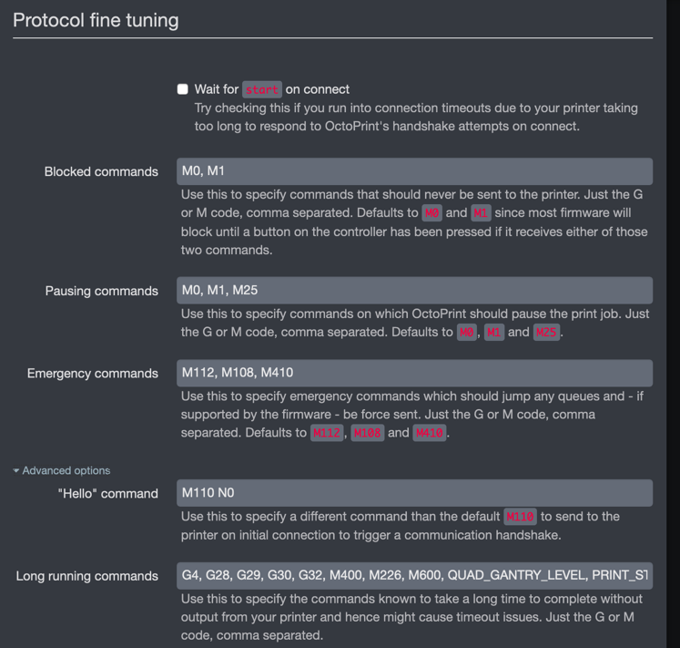

# System Troubleshooting

### Lights Flickering with Bed Heater

This is caused by crappy wiring in your house + the bed heater being on. By default the heater is using a PID algorithm to keep its temperature at the set value -- this switches the heater on and off quickly (a bigger VORON has 700W+ mains heater; a 300mm V2 can pull 6-8 Amps at peak load, which can overload a circuit if there is too much else going on), this causes the flicker in your home electrical network.

In the `[heater_bed]` section make the following changes:

* If line power is 60Hz, add a line `pwm_cycle_time: 0.0166`
* If line power is 50Hz, add a line `pwm_cycle_time: 0.02`

### OctoPrint Serial Timeout

OctoPrint has built-in timeout for the internal serial connection to Klipper.  Some of the macros such as `PRINT_START` can take a long time to execute and cause Octoprint to disconnect.  Instead of increasing the timeouts, add one or more of the macro names to the list of long-running commands.

The long-running commands can be found under 'Settings' -> 'Serial Connection' -> 'Firmware & Protocol'. Then under 'Protocol Fine Tuning', expand the 'Advanced' section to locate the 'Long Running Commands' list.

